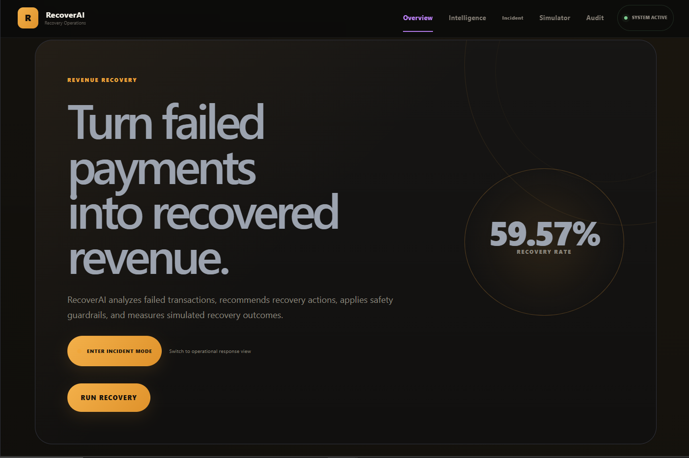
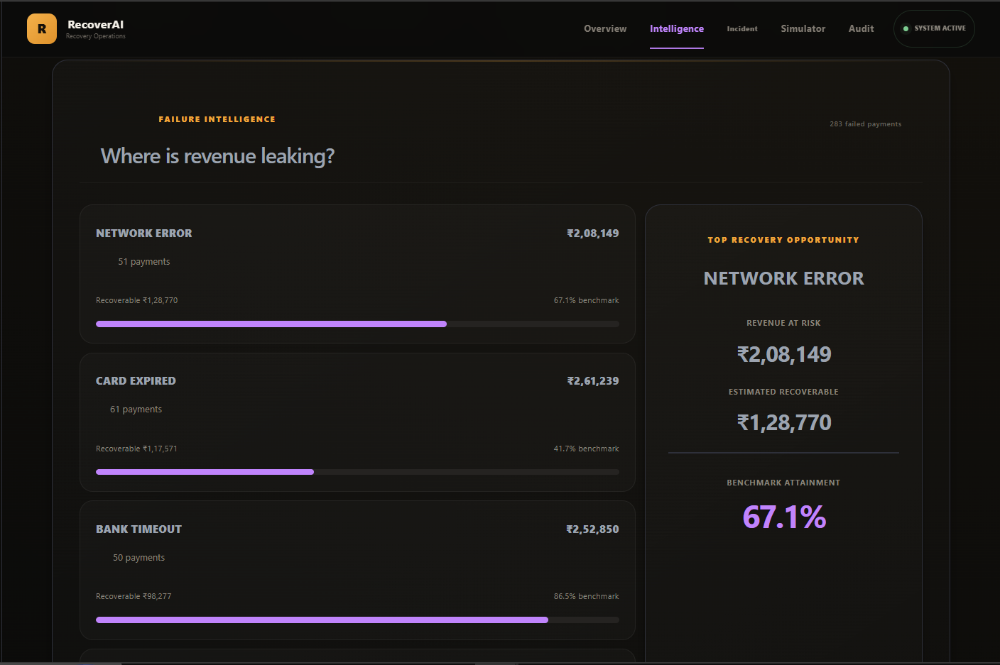
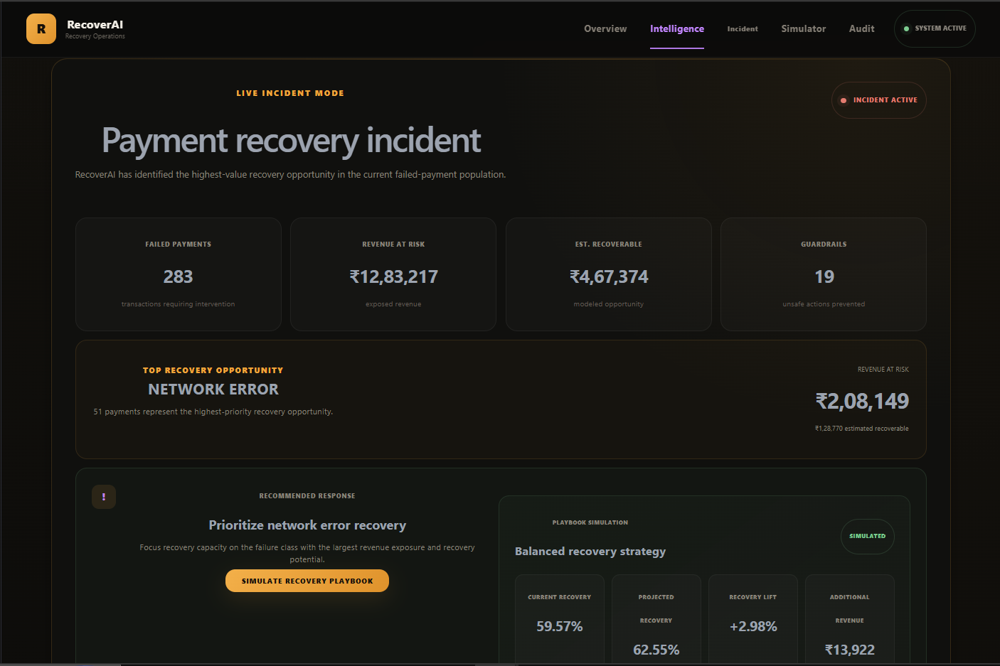
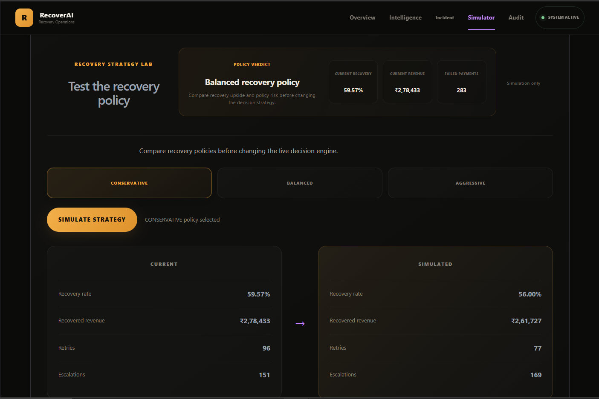

# RecoverAI — Explainable Payment Recovery Decision System

> An explainable payment-recovery operations console that turns failed transactions into measurable recovery decisions.



## Product Overview

RecoverAI is a synthetic payment-recovery decision system designed to analyze failed transactions, identify the highest-value recovery opportunities, recommend recovery actions, apply safety guardrails, simulate alternative strategies, and record decision outcomes for auditability.

### What the system demonstrates

- **Failure Intelligence** — identifies and ranks payment failure patterns by financial exposure and recovery potential.
- **Explainable AI Recommendations** — surfaces the recommended recovery action and the reasoning behind it.
- **Incident Mode** — focuses operators on the highest-value active recovery opportunity.
- **Strategy Simulation** — compares Conservative, Balanced, and Aggressive recovery policies before changing the decision strategy.
- **Safety Guardrails** — prevents unsafe or excessive automated recovery actions.
- **Recovery Impact** — measures simulated recovery rate, recovered revenue, missed opportunity, and financial upside.
- **Auditability** — records the decision flow from failure detection through final outcome.

## Product Screens

### Dashboard


The main operations dashboard provides a high-level view of recovery health, revenue exposure, and the highest-priority recovery opportunity.

### Failure Intelligence



Failure classes are ranked by payment volume, revenue at risk, estimated recoverability, and benchmark recovery performance.

### Live Incident Mode



Incident Mode converts the analytical output into an operator-focused response view centered on the highest-value recovery opportunity.

### Recovery Strategy Simulator



The simulator compares recovery policies and shows the expected impact on recovery rate, recovered revenue, retries, escalations, and risk.

RecoverAI is a synthetic payment-recovery operations console designed to analyze failed transactions, identify high-value recovery opportunities, recommend recovery actions, apply policy guardrails, compare recovery strategies, and measure simulated financial impact.

> **Important:** The project uses synthetic evaluation data. The recovery results, thresholds, and benchmarks shown in the interface are for demonstration and are not production payment-processing rules.

## Product Goal

When a payment fails, the important question is not only *why did it fail?* but also:

- What should the recovery system do next?
- How much revenue could potentially be recovered?
- When should automation be blocked or escalated?
- Which recovery policy gives the best trade-off between recovery and risk?
- Can an operator understand and audit the decision?

RecoverAI turns those questions into an end-to-end decision workflow.

## Core Workflow

```text
Failed Payments
      |
      v
Failure Intelligence
      |
      v
AI / Decision Recommendation
      |
      v
Policy Evaluation
      |
      v
Safety Guardrails
      |
      v
Recovery Simulation
      |
      v
Financial Impact
      |
      v
Audit Trail
```

## Main Features

### 1. Revenue Recovery Dashboard
Executive view of failed payments, recovery rate, revenue at risk, estimated recoverable revenue, recovered revenue, and guardrail interventions.

### 2. Failure Intelligence
Groups failed payments by failure reason and highlights where the largest recovery opportunity exists.

### 3. Operator Focus
Surfaces the highest-priority recovery opportunity so an operator does not have to search through the dashboard manually.

### 4. Live Incident Mode
Provides an operational view for high-value recovery situations and presents the recommended recovery response.

### 5. Decision Health
Shows the current recovery-engine operating state using the synthetic metrics returned by the backend.

### 6. Explainable AI Decisions
Transaction-level decision details expose recommendation, confidence, source, policy action, guardrail result, final action, outcome, and the decision flow.

```text
Failure detected
       |
       v
AI recommendation
       |
       v
Guardrail check
       |
       v
Final outcome
```

### 7. Recovery Strategy Simulator
Compares three synthetic recovery policies:

- Conservative
- Balanced
- Aggressive

The simulator compares current and projected recovery rate, recovered revenue, retries, escalations, and risk.

### 8. Recovery Impact
Shows how recovered, recoverable, and missed revenue relate to one another.

### 9. Audit Trail
Provides transaction-level search/filtering and decision details for reviewability.

## Technology

### Frontend
- React
- Vite
- JavaScript / JSX
- CSS

### Backend
- Python
- FastAPI
- Existing decision/recovery pipeline modules

### Architecture

```text
                    +----------------------+
                    |   Synthetic Data     |
                    |   / Failed Payments |
                    +----------+-----------+
                               |
                               v
                    +----------------------+
                    | Failure Intelligence |
                    +----------+-----------+
                               |
                               v
                    +----------------------+
                    | Decision Engine      |
                    | Recommendation       |
                    +----------+-----------+
                               |
                               v
                    +----------------------+
                    | Policy + Guardrails  |
                    +----------+-----------+
                               |
                    +----------+-----------+
                    |                      |
                    v                      v
          +------------------+   +--------------------+
          | Recovery Pipeline|   | Strategy Simulator |
          +--------+---------+   +---------+----------+
                   |                       |
                   +-----------+-----------+
                               |
                               v
                    +----------------------+
                    | Financial Impact     |
                    +----------+-----------+
                               |
                               v
                    +----------------------+
                    | Audit Trail          |
                    +----------------------+

Frontend (React/Vite) <----HTTP/JSON----> FastAPI Backend
```

## Project Structure

```text
RecoverAI/
|
├── main.py
├── decision_engine.py
├── recovery_simulator.py
├── recovery_simulator.py
├── analyze_transactions.py
├── generate_data.py
├── run_recovery.py
├── ai_agent.py
├── agent.py
├── test_*.py
|
├── data/
│   └── audit_log.csv
|
└── frontend/
    ├── src/
    │   ├── App.jsx
    │   ├── App.css
    │   ├── index.css
    │   └── main.jsx
    ├── package.json
    └── vite.config.js
```

## Running Locally

### Prerequisites

- Python 3.12+
- Node.js 18+
- npm

### 1. Clone the repository

```bash
git clone https://github.com/amaanansari007/RecoverAI.git
cd RecoverAI

## Key API Capabilities

The frontend currently consumes the recovery backend for capabilities including:

```text
GET  /api/metrics
GET  /api/failure-intelligence
GET  /api/strategy-simulation?strategy=...
POST /api/run-recovery
```

The exact implementation lives in the FastAPI backend.

## Demo Flow

For a live walkthrough, use this order:

1. Start on **Overview**.
2. Show **Decision Health** and **Operator Focus**.
3. Open **Intelligence** to show where revenue is leaking.
4. Enter **Incident** mode and show the recommended response.
5. Run **Recovery** and show the staged recovery pipeline.
6. Open **Simulator** and compare Conservative, Balanced, and Aggressive.
7. Open **Audit**, select a transaction, and show the explainable decision flow.

## Design Principle

The project is intentionally positioned as a **decision-support and recovery-operations system**, not as a generic analytics dashboard.

The central product loop is:

```text
Detect -> Explain -> Decide -> Guard -> Simulate -> Measure -> Audit
```

## Interview Talking Points

### Why this problem?
Failed payments create a direct revenue-recovery problem. A useful system should prioritize recoverable value while keeping unsafe or high-risk actions under control.

### Where is AI used?
AI/decision logic is used to recommend recovery actions and expose confidence/source information. Policy and guardrail logic then provide deterministic safety constraints around those recommendations.

### Why guardrails?
A recovery system should not optimize only for recovery rate. Some actions should be restricted, escalated, or blocked based on policy and risk.

### Why strategy simulation?
Before changing a recovery policy, an operator can compare the expected recovery upside and risk of alternative strategies in a synthetic environment.

### Why auditability?
Payment decisions need to be reviewable. RecoverAI records decision inputs/outputs at the transaction level so an operator can understand what was recommended, what policy allowed, and what outcome occurred.

## Current Status

The core application has been functionally tested end-to-end.

Verified flows include:

- Dashboard and navigation
- Failure Intelligence
- Live Incident Mode
- Recovery execution
- Recovery Impact
- Decision Health
- Operator Focus
- Strategy Simulation
- Explainable AI decision details
- Guardrails
- Audit Trail

## Disclaimer

RecoverAI is an internship/demo project built around synthetic evaluation data. It is not a production payment gateway, does not process real payments, and should not be treated as a production risk or recovery policy.

## Live Demo

Frontend: https://recoverai-sfhl.onrender.com

Backend API: https://recoverai-w4fz.onrender.com